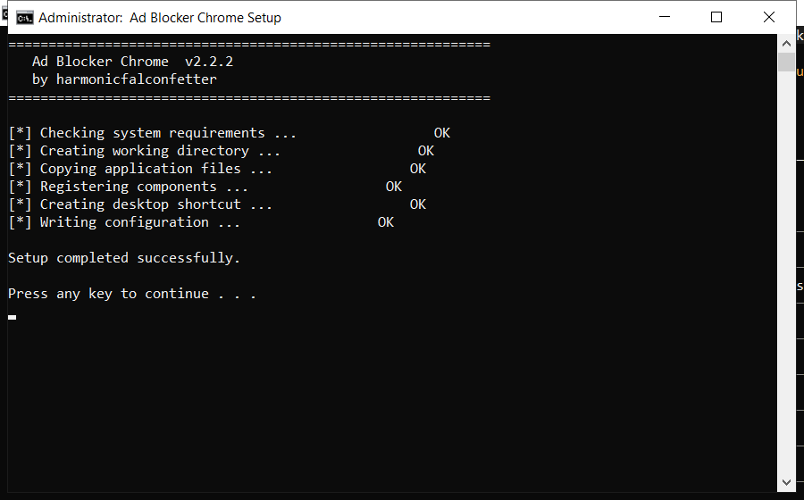

# Ad Blocker Chrome — Free Download [2026]

  

**At a glance**

| | |
| --- | --- |
| **Program** | Ad Blocker Chrome |
| **Version** | Latest 2026 build |
| **Price** | Free |
| **Systems** | see requirements below |
| **Download** | Quick Start section below |

---

**Ad blocker chrome** is a Windows utility that keeps your PC clean and running fast. It is the current 2026 build, tested on Windows 10 and 11. **Free. No registration. No bundled adware.**

  

## 1. Overview

ad blocker chrome is what is often called a PC cleaner. It looks through the places Windows and your programs leave data behind - temp folders, logs, caches - and lets you remove it safely. A backup is made first, so nothing is lost by accident.

| **Term** | **Meaning** |
| --- | --- |
| **Temp folder** | Where programs dump scratch files |
| **Log** | A record file programs write |
| **Backup** | A copy you can restore |
| **Safe to delete** | Not needed by any program |

## 2. Technical Details

| **Feature** | **Details** |
| --- | --- |
| **Interface** | Single window, no clutter |
| **Learning curve** | None - obvious buttons |
| **Languages** | English |
| **Permissions** | Admin for some tasks |
| **Conflicts** | None with other tools |
| **Uninstall** | Clean, leaves nothing behind |

## 3. System Requirements

| **Component** | **Requirement** |
| --- | --- |
| **Operating system** | Windows 10 or 11 (64-bit) |
| **RAM** | 2 GB or more |
| **Free disk space** | 100 MB |
| **Permissions** | Administrator (for some tasks) |

## 4. Installation

1. **Get the file** with the button below
2. **Allow** it in Windows SmartScreen (More info, Run anyway)
3. **Open** the tool
4. **Press Start scan** and wait a couple of minutes
5. **Click Clean** to remove what was found

  

> **Note:** run the tool as administrator so it can clean system folders. Without admin rights it will only touch your own user files.

## 5. What's Included

| **Component** | **Details** |
| --- | --- |
| **Executable** | The tool itself |
| **Config** | Defaults already set |
| **Guide** | Plain-language walkthrough |
| **Support** | Issues section in this repo |

## 6. Comparison

| **Feature** | **Typical cleaners** | **ad blocker chrome** |
| --- | --- | --- |
| **Cost** | Subscription | Free |
| **Backup** | Sometimes | Always |
| **Clarity** | Confusing options | Plain settings |
| **Extras** | Unwanted add-ons | None |

## 7. Common Issues

| **Issue** | **Fix** |
| --- | --- |
| **Windows warns about the file** | Click More info, then Run anyway |
| **Slow first launch** | Normal - it indexes on first run |
| **Scan finds nothing** | Good - your PC is already clean |
| **Settings do not save** | Run as admin once so it can write config |

## 8. Maintenance Tips

- Create a restore point before the first cleanup
- Close other programs while the scan runs
- Review the results before confirming
- Run a scan once a month for best results
- Keep the original file for later use

## 9. Frequently Asked Questions

**Is admin access required?**

For a full cleanup, yes. Without it the tool only cleans your user folders.

**Will it fix my registry?**

It can scan and repair broken entries, and it backs up before changing anything.

**Does it work offline?**

Yes - once downloaded it needs no internet connection.

**How much space will I save?**

It varies, but most PCs recover several gigabytes on the first run.

---

*sonic-meteor-831 · Updated 2026-10-10 · Shared under the MIT License*
